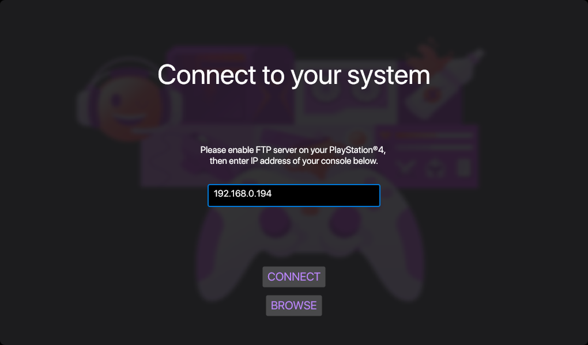
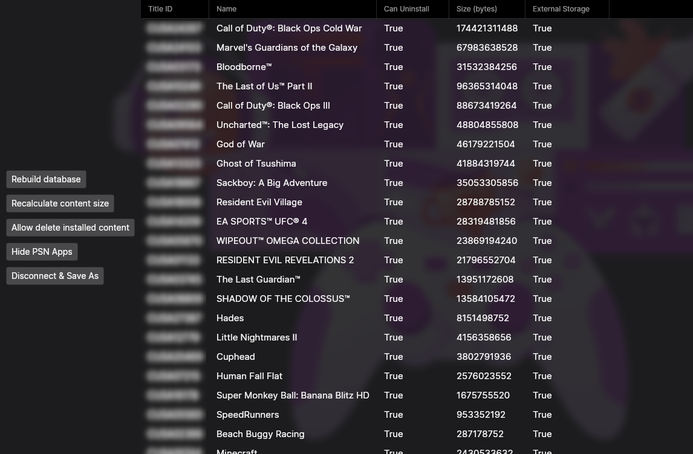
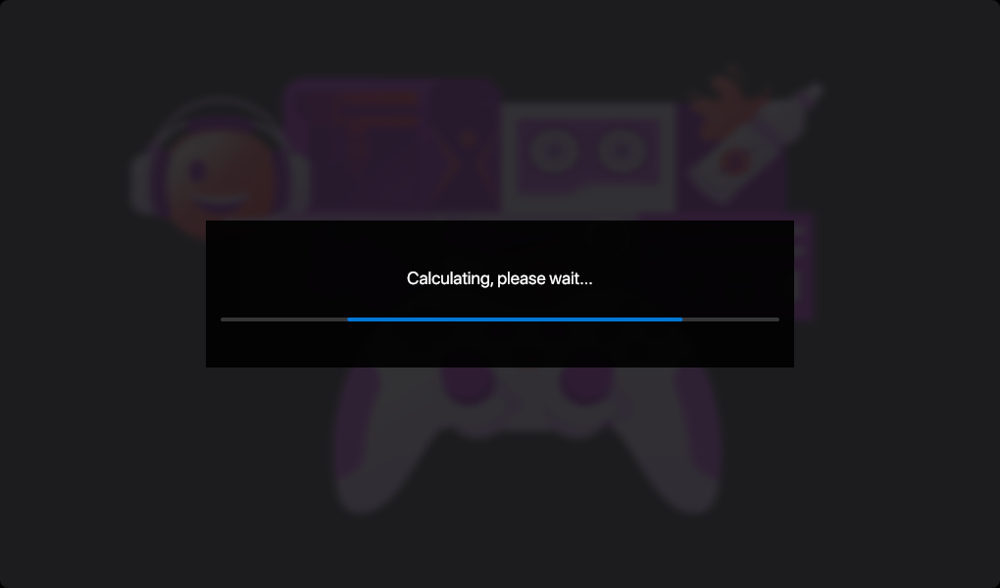

# OrbisDbTools

OrbisDbTools is a free cross-platform application for interacting with hacked `PlayStation®4` system databases.  

## Features

* Recalculate installed application size (fixes absurd game sizes in [this screen](promo/screen4.jpg))
* Allow to delete user all installed applications
* Hide apps that require PSN ([listed here](https://github.com/valters-tomsons/OrbisDbTools/blob/main/src/OrbisDbTools.PS4/KnownContent.cs#L22))

This tool will also automatically backup your `app.db` file to `$TMPDIR/app.db.$TIMESTAMP` when connecting via network. Local database files are backed up in file directory with `.$TIMESTAMP` appended to filename.

## Usage

* Download latest release from `Releases` section
* Extract archive
* Launch `OrbisDbTools.Avalonia` executable
* After patching, upload resulting `app.db` to your PS4 at `/system_data/priv/mms/app.db`

## Screenshots

